# Production Architecture: Escrow Desk

## The Core Problem — Escrows That Wait

An indemnity holdback escrow is unusual software territory: a transaction opens, then the system does almost nothing for 12–18 months. At the end of that period it wakes up, checks a set of conditions, and — if everything passes — moves a large sum of money exactly once.

That long-wait, exactly-once pattern is a poor fit for a traditional request/response web service. A cron job can miss a window. A REST endpoint can be called twice. An event queue doesn't track where you are in a multi-step process across a server restart. What it fits naturally is a **durable workflow**.

---

## Production Shape: Durable Workflow per Escrow

Each escrow would run as its own workflow instance in a system like [Temporal](https://temporal.io) or AWS Step Functions. The workflow persists its state durably, survives restarts, and picks up exactly where it left off.

```mermaid
stateDiagram-v2
    [*] --> Holding : Escrow funded at closing

    Holding --> ScheduledRelease : Release date reached
    Holding --> ClaimFiled : Buyer files claim notice
    ClaimFiled --> Holding : Claim resolved / withdrawn
    ClaimFiled --> Disputed : Seller objects

    ScheduledRelease --> AwaitingInstruction : Notify buyer + seller
    Disputed --> AwaitingInstruction : Joint resolution reached
    AwaitingInstruction --> AwaitingApproval : Both instructions received
    AwaitingApproval --> PostingToCore : Supervisor approves (dual control)

    PostingToCore --> WireConfirmed : Core ledger confirms
    PostingToCore --> PostFailed : Core ledger rejects
    PostFailed --> PostingToCore : Retry with backoff
    PostFailed --> ManualIntervention : Max retries exceeded

    WireConfirmed --> Closed : Balance = 0
    WireConfirmed --> Holding : Partial release; balance > 0

    ManualIntervention --> PostingToCore : Ops resolves and retries
```

### Key workflow activities

| Activity | Notes |
|---|---|
| `waitForReleaseDate` | Workflow sleeps (durable timer) until the scheduled date |
| `notifyParties` | Sends release notice to buyer and seller via email/portal |
| `waitForInstructions` | Blocks until both parties submit signed instructions |
| `validateChecklist` | Runs all pre-release checks; returns pass/fail per item |
| `postToCoreLedger` | Idempotent: uses `releaseId` as the deduplication key |
| `awaitCoreConfirmation` | Async; waits for callback from core banking system |
| `emitReleaseEvents` | Fans out to GL, CRM, compliance, document management |

---

## Idempotency and Double-Post Prevention

Wire disbursements are irreversible. The system must guarantee exactly-once posting.

**Mechanism:**
1. Each release is assigned a stable `releaseId` at creation time.
2. `postToCoreLedger` passes `releaseId` as the idempotency key to the core system.
3. The core system rejects a second post with the same key — returning the original confirmation rather than posting again.
4. The workflow engine (Temporal/Step Functions) retries failed activities automatically; because the activity is idempotent, retries are safe.
5. The workflow state machine tracks whether a release has reached `wire-pending` — a second approval attempt is rejected at the workflow level before it reaches the core system.

This matches the PoC's mock gateway, which maintains an in-memory idempotency map keyed by `releaseId` and returns the same result on repeated calls.

---

## Event Fan-Out After Confirmation

Once the core ledger confirms the wire, the workflow emits a `ReleaseConfirmed` event. Downstream systems subscribe:

- **General Ledger** — posts the debit to the escrow liability account
- **CRM / Relationship Manager** — notifies the RM that the escrow has disbursed
- **Compliance / Audit** — appends an immutable record: who approved, when, snapshot of state at approval
- **Document Management** — archives the joint instruction, wire confirmation, and approval snapshot
- **Notifications** — sends confirmation to buyer and seller

---

## How the PoC Maps to This Architecture

| PoC component | Production equivalent |
|---|---|
| In-memory `EscrowStore` | Workflow instance state + core banking escrow account |
| `createSeedStore()` | Escrows opened at deal closing, funded by wire-in from buyer |
| Release checklist (`evaluateChecklist`) | `validateChecklist` activity in the workflow |
| Role switcher (Officer / Supervisor) | IAM roles + MFA-gated approval; segregation of duties enforced by the auth system |
| `CoreLedgerGateway` interface | The seam where a `FedwireGateway` or core banking adapter plugs in |
| `MockCoreLedgerGateway` | Replaced by a concrete adapter at deploy time via `VITE_CORE_GATEWAY` env var |
| Idempotent mock (same ref on repeated calls) | Same contract, enforced by the real core system |
| `RELEASE_WIRE_FAILED` reducer action | Workflow activity failure → retry with exponential backoff |
| Manual confirm by Supervisor | Callback from core banking system (auto in production; manual is the fallback) |
| Append-only ledger in memory | Append-only event log; never update or delete entries |
| Reset button | Does not exist in production — idempotency and workflow state replace it |
| `useBusinessDay` / Nager.Date API | Bank holiday calendar cached at infrastructure layer; same gate applies |

---

## What the PoC Demonstrates

Even without the durable workflow runtime, the PoC shows the correct **shape** of the problem:

- The checklist is the contract — every condition maps to a named workflow activity
- The ledger is append-only — the foundation of an auditable system
- Role separation is enforced in the UI — the seam where IAM replaces the dropdown
- The gateway is behind an interface — the seam where the real core adapter plugs in
- Double-release is prevented in the state machine — the same guard that a workflow engine enforces durably

The architecture doc and the PoC together tell the full story: here is the problem, here is the right production design, and here is a working demonstration of the decision logic.
